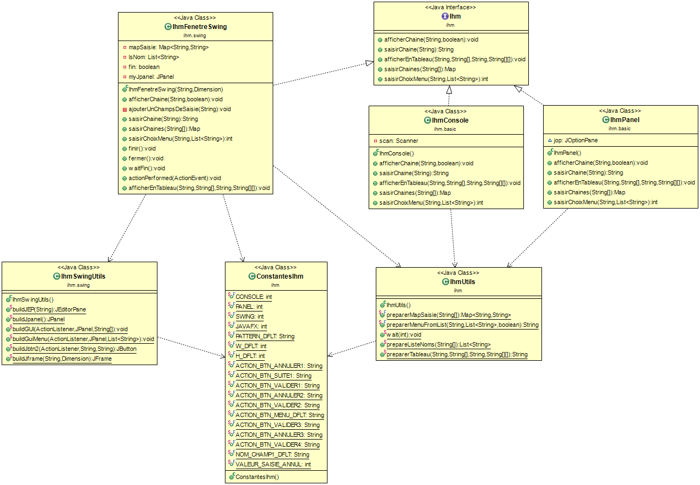

# JAVA_IHMS

Une petite bibliothèque au format JAR permettant de mettre rapidement en place trois type d'IHM:
- un IhmConsole: saisie et affichage dans la console;
- un IhmPanel: saisie et affichage avec des JPanel;
- un IhmSwing: saisie et affichage dans une fen^tre de type SWING.

